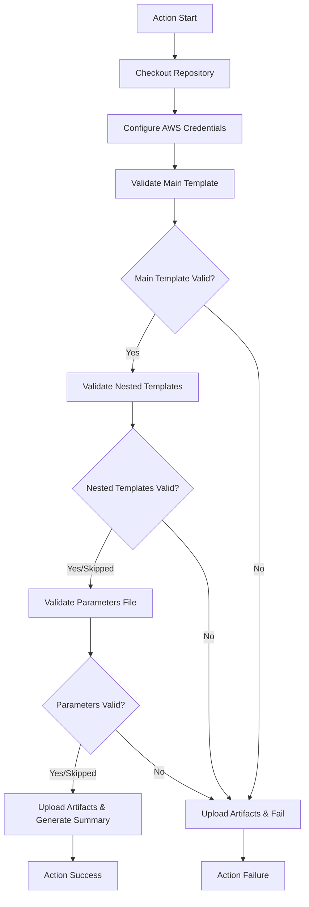

# Design Document

## Overview

The CloudFormation Validation Action is a GitHub composite action that provides comprehensive validation for CloudFormation templates, nested templates, and parameter files. The action integrates with AWS CloudFormation's validation API to ensure templates are syntactically correct and properly structured before deployment.

The action follows GitHub Actions best practices by using composite action structure, providing clear input/output interfaces, and generating comprehensive validation reports with artifacts for debugging.

## Architecture

The action is implemented as a GitHub composite action that orchestrates multiple validation steps:



## Components and Interfaces

### Input Parameters

The action accepts the following input parameters:

- `cloudformation-dir` (optional): Directory containing CloudFormation templates (default: ".")
- `template-file` (optional): Main CloudFormation template filename (default: "template.yaml")
- `parameters-file` (optional): Parameters file name (default: "parameters.json")
- `aws-region` (optional): AWS region for validation (default: "us-east-1")
- `aws-role-arn` (required): AWS IAM role ARN for authentication
- `github-token` (optional): GitHub token for artifact upload (default: ${{ github.token }})

### Output Parameters

The action provides the following outputs:

- `validation-result`: Overall validation result (success/failure)
- `main-template-result`: Main template validation result (success/failure)
- `nested-templates-result`: Nested templates validation result (success/failure/skipped)
- `parameters-result`: Parameters file validation result (success/failure/skipped)

### File Structure

```
action.yaml                 # Main action definition
README.md                  # Action documentation
CHANGELOG.md              # Version history
```

### Validation Steps

1. **Repository Checkout**: Uses `actions/checkout@v4` to access repository files
2. **AWS Authentication**: Uses `aws-actions/configure-aws-credentials@v4` with IAM role assumption
3. **Main Template Validation**: Validates primary CloudFormation template syntax
4. **Nested Templates Validation**: Validates all templates in nested-templates directory
5. **Parameters Validation**: Validates JSON structure and syntax of parameters file
6. **Artifact Upload**: Uploads validation results and logs
7. **Summary Generation**: Creates markdown summary for GitHub step summary

## Data Models

### Validation Output Structure

```json
{
  "Description": "Template description",
  "Parameters": [
    {
      "ParameterKey": "string",
      "DefaultValue": "string",
      "NoEcho": boolean,
      "Description": "string"
    }
  ],
  "Capabilities": ["CAPABILITY_IAM", "CAPABILITY_NAMED_IAM"],
  "CapabilitiesReason": "string"
}
```

### Parameters File Structure

```json
[
  {
    "ParameterKey": "string",
    "ParameterValue": "string"
  }
]
```

### Environment Variables

- `CLOUDFORMATION_DIR`: Template directory path
- `TEMPLATE_FILE`: Main template filename
- `PARAMETERS_FILE`: Parameters filename
- `AWS_REGION`: AWS region for validation
- `GITHUB_OUTPUT`: GitHub Actions output file path
- `GITHUB_STEP_SUMMARY`: GitHub Actions step summary file path

## Error Handling

### Template Validation Errors

- **File Not Found**: Clear error message with directory listing
- **Syntax Errors**: AWS CloudFormation API error messages with line numbers
- **Permission Errors**: AWS authentication and authorization error handling

### Nested Template Validation

- **Directory Not Found**: Skip validation and report as skipped
- **Individual Template Failures**: Continue validation of remaining templates, report all failures
- **No Templates Found**: Skip validation and report as skipped

### Parameters File Validation

- **File Not Found**: Skip validation and report as skipped
- **JSON Syntax Errors**: Detailed JSON parsing error messages
- **Structure Validation**: Clear messages about required array structure with ParameterKey/ParameterValue objects

### AWS API Error Handling

- **Rate Limiting**: Built-in AWS CLI retry logic
- **Authentication Failures**: Clear error messages about role assumption
- **Service Unavailability**: Appropriate error reporting with retry suggestions

## Testing Strategy

### Unit Testing Approach

1. **Template Validation Tests**
   - Valid CloudFormation templates (YAML/JSON)
   - Invalid syntax templates
   - Templates with various capabilities
   - Templates with parameters

2. **Nested Template Tests**
   - Directory with valid nested templates
   - Directory with mixed valid/invalid templates
   - Missing nested templates directory
   - Empty nested templates directory

3. **Parameters File Tests**
   - Valid parameters JSON structure
   - Invalid JSON syntax
   - Invalid structure (non-array, missing keys)
   - Missing parameters file

4. **Integration Tests**
   - End-to-end workflow with valid templates
   - End-to-end workflow with validation failures
   - AWS authentication scenarios
   - Artifact upload verification

### Test Data Structure

```
tests/
├── fixtures/
│   ├── valid-templates/
│   │   ├── template.yaml
│   │   ├── parameters.json
│   │   └── nested-templates/
│   │       └── nested.yaml
│   ├── invalid-templates/
│   │   ├── syntax-error.yaml
│   │   └── invalid-parameters.json
│   └── mixed-scenarios/
└── workflows/
    └── test-action.yml
```

### Validation Criteria

- All validation steps execute in correct sequence
- Error messages are clear and actionable
- Artifacts are properly uploaded with correct retention
- Step summary contains accurate validation results
- Output parameters reflect actual validation status
- AWS API calls are properly authenticated and handled

### Performance Considerations

- Template validation should complete within 2 minutes for typical templates
- Nested template validation should process up to 50 templates efficiently
- Memory usage should remain under 512MB for large template sets
- Network timeouts should be handled gracefully with appropriate retries