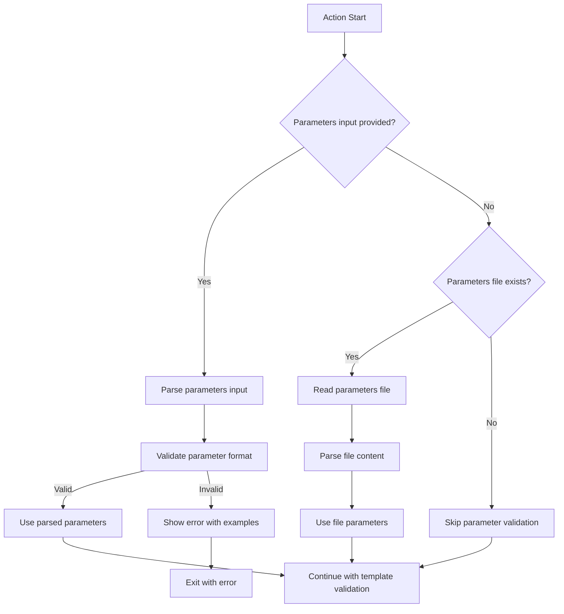

# Design Document

## Overview

This design enhances the CloudFormation Template Validator action to accept parameters directly as input in addition to the existing file-based approach. The enhancement maintains backward compatibility while providing more flexibility for dynamic parameter handling.

## Architecture

### Input Processing Flow



### Parameter Priority Logic

1. **Direct Input Priority**: If `parameters` input is provided, use it exclusively
2. **File Fallback**: If no `parameters` input, check for `parameters-file`
3. **Skip Validation**: If neither is available, skip parameter validation

## Components and Interfaces

### New Input Parameter

```yaml
inputs:
  parameters:
    description: 'CloudFormation parameters as JSON array string'
    required: false
    default: ''
```

### Parameter Format Specification

**Expected Format:**
```json
[
  {
    "ParameterName": "BucketName",
    "ParameterValue": "subhamay-github-action-template-bucket-06611-17"
  },
  {
    "ParameterName": "CiBuildId", 
    "ParameterValue": "-ysfulaqv"
  }
]
```

**Note:** The format uses `ParameterName` and `ParameterValue` (not `ParameterKey`) to match the user's specification.

### Modified Parameter Validation Function

```bash
validate_parameters() {
  local parameters_input="$1"
  local parameters_file="$2"
  
  # Priority: input > file > skip
  if [[ -n "${parameters_input}" ]]; then
    echo "🔍 Using parameters from input"
    validate_parameters_from_input "${parameters_input}"
  elif [[ -f "${parameters_file}" ]]; then
    echo "🔍 Using parameters from file: ${parameters_file}"
    validate_parameters_from_file "${parameters_file}"
  else
    echo "⏭️ No parameters provided, skipping validation"
    return 0
  fi
}
```

## Data Models

### Parameter Object Structure

```typescript
interface CloudFormationParameter {
  ParameterName: string;
  ParameterValue: string;
}

type ParametersArray = CloudFormationParameter[];
```

### Validation Rules

1. **Array Structure**: Must be a valid JSON array
2. **Object Properties**: Each object must have `ParameterName` and `ParameterValue`
3. **String Values**: Both properties must be strings
4. **Non-empty Names**: `ParameterName` cannot be empty
5. **Unique Names**: Parameter names should be unique within the array

## Error Handling

### Input Validation Errors

1. **Invalid JSON**: Clear message with JSON syntax help
2. **Wrong Structure**: Show expected format with examples
3. **Missing Properties**: Specify which properties are required
4. **Empty Parameter Names**: Highlight the problematic entries

### Error Message Examples

```bash
# Invalid JSON
echo "::error::Invalid parameters JSON format. Expected array of objects."

# Wrong structure  
echo "::error::Invalid parameter structure. Expected format:"
echo '[{"ParameterName": "string", "ParameterValue": "string"}]'

# Missing properties
echo "::error::Parameter object missing required properties: ParameterName, ParameterValue"
```

## Testing Strategy

### Unit Tests

1. **Valid Input Parsing**: Test various valid parameter formats
2. **Invalid Input Handling**: Test malformed JSON and structures
3. **Priority Logic**: Test input vs file priority
4. **Backward Compatibility**: Ensure existing file-based workflows work

### Integration Tests

1. **End-to-End Validation**: Test with actual CloudFormation templates
2. **Error Scenarios**: Test various error conditions
3. **Mixed Scenarios**: Test combinations of input and file parameters

### Test Cases

```yaml
# Valid direct input
parameters: '[{"ParameterName":"Environment","ParameterValue":"prod"}]'

# Invalid JSON
parameters: '[{"ParameterName":"Environment","ParameterValue":"prod"'

# Missing properties
parameters: '[{"ParameterName":"Environment"}]'

# Empty array (should skip validation)
parameters: '[]'

# Priority test (input should win)
parameters: '[{"ParameterName":"Environment","ParameterValue":"prod"}]'
parameters-file: 'test-params.json'
```

## Implementation Considerations

### Backward Compatibility

- Existing `parameters-file` input remains unchanged
- Default behavior when no parameters provided remains the same
- All existing outputs and error handling preserved

### Performance Impact

- Minimal impact as parameter parsing is lightweight
- Input parsing happens before file I/O, potentially faster
- No additional external dependencies required

### Security Considerations

- Input sanitization for JSON parsing
- Proper escaping of parameter values in logs
- No sensitive data exposure in error messages

## Migration Path

### Phase 1: Add New Input
- Add `parameters` input to action.yaml
- Implement parsing and validation logic
- Maintain full backward compatibility

### Phase 2: Update Documentation
- Add examples for both input methods
- Update README with migration guidance
- Add troubleshooting section

### Phase 3: Deprecation (Future)
- Consider deprecating file-based approach in future major version
- Provide clear migration timeline and tools